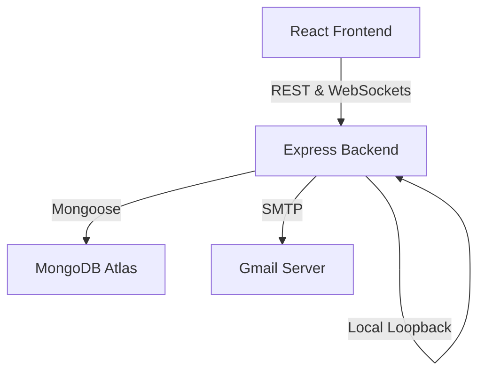

# Engagement.AI - AI-Native Mini CRM

Engagement.AI is a premium, modern, AI-native Mini CRM designed to segment customers, generate hyper-personalized marketing copy, and track email campaign conversions in real-time.

---

## Architecture & Tech Stack

### System Diagram


### Stack Details
* **Frontend**: React (Vite), Tailwind CSS, Recharts (analytics graphs), Lucide React (icons), Socket.io-client.
* **Backend**: Node.js, Express, Socket.io (real-time events), Mongoose, Nodemailer (email delivery), Axios.
* **AI Engine**: Meta-Llama-3-8B-Instruct (via Hugging Face API) for smart customer segmentation and copywriting.

---

## Key Features

1. **Smart Audience Upload**: Drag and drop CSV or Excel customer directory files.
2. **AI Segmentation**: Classify customers automatically into *High Value*, *Likely to Repurchase*, and *At Risk* cohorts.
3. **Personalized Copywriting**: Generate custom-targeted email templates for campaigns using Llama-3.
4. **Gmail Integration**: Send real emails to campaign members using secure Gmail SMTP.
5. **Live Funnel Analytics**: Watch status progression (`SENT` ➔ `DELIVERED` ➔ `OPENED` ➔ `CLICKED` ➔ `PURCHASED`) update in real-time on the campaign dashboard via WebSockets.

---

## Local Setup

### 1. Prerequisites
Ensure you have **Node.js** (v18+) and **MongoDB** installed on your system.

### 2. Backend Configuration
1. Navigate to the `backend/` directory.
2. Create a `.env` file:
   ```env
   PORT=5000
   MONGODB_URI=mongodb+srv://<username>:<password>@cluster0.mongodb.net/ai-mini-crm
   JWT_SECRET=your_jwt_secret_key
   FRONTEND_URL=http://localhost:3000
   
   # Hugging Face Token (AI Segmentation)
   HF_API_KEY=your_hugging_face_api_token
   
   # Gmail SMTP Credentials (Nodemailer)
   EMAIL_USER=your_gmail_address@gmail.com
   EMAIL_PASS=your_16_character_app_password
   ```
3. Run the backend:
   ```bash
   npm install
   npm run dev
   ```

### 3. Frontend Configuration
1. Navigate to the `frontend/` directory.
2. Create a `.env` file (Optional):
   ```env
   VITE_BACKEND_URL=http://localhost:5000
   ```
3. Run the frontend:
   ```bash
   npm install
   npm run dev
   ```
4. Access the web app at: **http://localhost:3000**

---

## Deployment Settings

### CRM Backend (Render)
* **Build Command**: `npm install`
* **Start Command**: `npm start`
* **Root Directory**: `backend`
* **Environment Variables**: Add `MONGODB_URI`, `JWT_SECRET`, `EMAIL_USER`, `EMAIL_PASS`, `HF_API_KEY`, and `FRONTEND_URL` (pointing to your Vercel site).

### React Frontend (Vercel)
* **Build Command**: `npm run build`
* **Output Directory**: `dist`
* **Root Directory**: `frontend`
* **Environment Variables**: Add `VITE_BACKEND_URL` (pointing to your Render API server).
